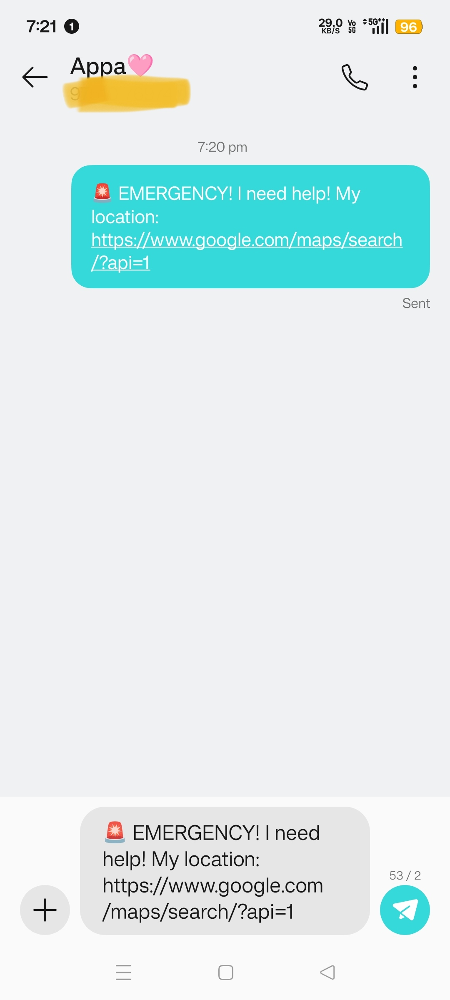

# sos_app
# 🚨 Smart Silent SOS App

## 📱 Project Description
Smart Silent SOS is a Flutter-based mobile application designed to help users send emergency alerts quickly with live location tracking and emergency notifications.

## ⭐ Features
- 🚨 Emergency SOS alert system
- 📍 Live location sharing
- 📩 Instant message to emergency contacts
- 🔔 Silent mode activation for safety

## 🛠️ Tech Stack
- Flutter (Dart)
- Android SDK
- Firebase (optional backend)
- GPS Location Services

## 🎯 Purpose
This project is developed for safety purposes, especially for emergencies where users need quick help.

## 📲 How to Run
1. Clone this repository
2. Run `flutter pub get`
3. Use `flutter run` to start app
## 📸 Application Screenshots

## 📸 Application Screenshots

### Home Screen

This is the main interface of the Smart Silent SOS application.

### SOS Activation Screen

Users can trigger emergency alerts from this screen.

### Alert Confirmation Screen

The application confirms that the SOS alert has been sent successfully.

## 👨‍💻 Developer
Kamali P
B.Tech AI & DS Student
